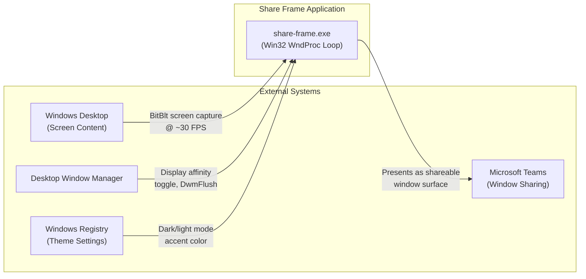
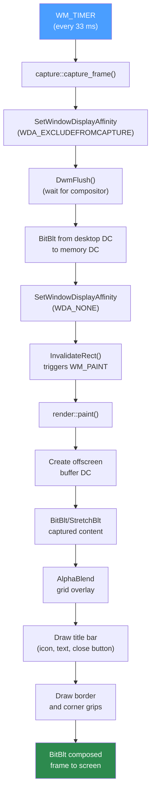
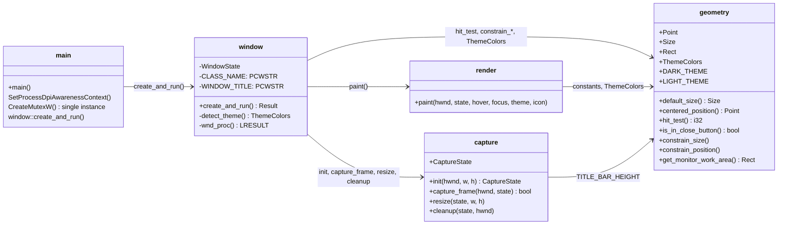

# Share Frame — Project Summary

## 1. Executive Summary

Share Frame is a lightweight, single-binary Windows desktop application that solves the ultrawide-monitor screen-sharing problem in Microsoft Teams. It creates a resizable overlay window that captures the desktop region behind it at ~30 FPS using Win32 GDI `BitBlt`, then presents that captured content as a normal shareable window. The application is built entirely in Rust against the `windows` crate (v0.58), uses no runtime dependencies beyond the Windows OS, and produces a single `share-frame.exe` with an embedded icon resource. Key capabilities include per-monitor DPI v2 awareness, adaptive dark/light theming with accent color support, single-instance enforcement, and a custom borderless window with native resize/move behavior.

## 2. Architecture Overview

Share Frame is a synchronous, single-threaded Win32 application. It has no async runtime, no network I/O, and no filesystem interaction beyond startup. The entire architecture is a classic Win32 message pump driving a capture-render loop.



The application sits between the Windows desktop (its capture source) and Microsoft Teams (which sees it as a regular window to share). It reads theme preferences from the Windows registry and coordinates with DWM for self-capture exclusion.

## 3. Processing Pipeline

The core loop is timer-driven: a `WM_TIMER` fires every 33 ms (~30 FPS), triggering a capture-then-paint cycle. The pipeline flows through four stages.



### Pipeline walkthrough

1. **Timer tick** — `WM_TIMER` fires at `TIMER_ID = 1` every 33 ms (set in `capture::init()`).
2. **Self-exclusion** — `capture::capture_frame()` calls `SetWindowDisplayAffinity(WDA_EXCLUDEFROMCAPTURE)` so the window is invisible to capture APIs, then `DwmFlush()` to wait for the compositor to apply the change.
3. **Screen capture** — `BitBlt` copies the desktop region directly below the title bar from the desktop DC into a memory DC. The source rectangle is the window's physical position offset by `TITLE_BAR_HEIGHT` (24 px).
4. **Affinity restore** — `SetWindowDisplayAffinity(WDA_NONE)` makes the window visible to capture APIs again (so Teams can see it).
5. **Invalidation** — `InvalidateRect()` queues a `WM_PAINT`.
6. **Double-buffered paint** — `render::paint()` composes the full frame to an offscreen bitmap: captured content, optional grid overlay (10% opacity, 48 px spacing when focused), title bar with icon and text, close button, and 2 px border with 6 px corner grips.
7. **Final blit** — A single `BitBlt` copies the composed frame to the screen DC, eliminating flicker.

During interactive resize/move (`WM_ENTERSIZEMOVE` / `WM_EXITSIZEMOVE`), captures are paused and the last frame is `StretchBlt`'d to fill the new size.

## 4. Core Components



### Module Responsibilities

| Module | File | Responsibility |
| -------- | ------ | ---------------- |
| `main` | [src/main.rs](../src/main.rs) | Entry point. Sets per-monitor DPI v2 awareness, enforces single instance via named mutex (`ShareFrame_SingleInstance_Mutex`), calls `window::create_and_run()`. |
| `window` | [src/window.rs](../src/window.rs) | Registers window class (`ShareFrameClass`), creates the popup window, runs the `GetMessageW` loop, and dispatches all Win32 messages through `wnd_proc`. Owns `WindowState`. |
| `capture` | [src/capture.rs](../src/capture.rs) | Manages screen capture. Creates a memory DC and compatible bitmap, runs a 33 ms timer, performs `BitBlt` capture with display-affinity toggling, handles resize/cleanup. |
| `render` | [src/render.rs](../src/render.rs) | Double-buffered `WM_PAINT` handler. Composes captured content, grid overlay, title bar (icon + text + close button), and border into an offscreen buffer, then blits to screen. |
| `geometry` | [src/geometry.rs](../src/geometry.rs) | Pure data types (`Point`, `Size`, `Rect`, `ThemeColors`) and pure functions for hit testing, size/position constraints, DPI conversion, and monitor work-area queries. Contains all unit tests. |

### Key Structs

| Struct | Module | Purpose |
| -------- | -------- | --------- |
| `CaptureState` | `capture` | Holds memory DC, bitmap, timer ID, dimensions, and flags (`capture_ok`, `affinity_supported`, `paused`). |
| `WindowState` | `window` | Per-window state: `CaptureState`, work area, close-button hover, mouse tracking, focus, theme colors, icon handle. Stored via `GWLP_USERDATA`. |
| `Point` | `geometry` | 2D coordinate (`x`, `y`). |
| `Size` | `geometry` | Dimensions (`width`, `height`). |
| `Rect` | `geometry` | Axis-aligned rectangle (`left`, `top`, `right`, `bottom`). |
| `ThemeColors` | `geometry` | Four `u32` COLORREF values: `border`, `active_border`, `title_bar_bg`, `title_bar_text`. |

### Constants

| Constant | Value | Module | Purpose |
| -------- | ----- | ------ | ------- |
| `TIMER_ID` | 1 | `capture` | Win32 timer identifier |
| `FRAME_INTERVAL_MS` | 33 | `capture` | Capture interval (~30 FPS) |
| `BORDER_WIDTH` | 2 | `geometry` | Window border thickness (px) |
| `GRIP_SIZE` | 6 | `geometry` | Corner resize grip (px) |
| `HIT_TEST_MARGIN` | 8 | `geometry` | Edge hit-test zone (px) |
| `MIN_WIDTH` / `MIN_HEIGHT` | 200 / 150 | `geometry` | Minimum window size (px) |
| `TITLE_BAR_HEIGHT` | 24 | `geometry` | Custom title bar height (px) |
| `CLOSE_BUTTON_WIDTH` | 36 | `geometry` | Close button width (px) |
| `CLOSE_BUTTON_HOVER_COLOR` | `RGB(232,17,35)` | `geometry` | Red hover background |

## 5. Public API / Type Contracts

Share Frame is a binary crate (`[[bin]]`), not a library. There is no public API for external consumers. Internal module visibility follows Rust conventions:

| Function | Signature | Visibility |
| -------- | --------- | ---------- |
| `window::create_and_run` | `() -> windows::core::Result<()>` | `pub` (crate) |
| `capture::init` | `(HWND, i32, i32) -> CaptureState` | `pub` (crate) |
| `capture::capture_frame` | `(HWND, &mut CaptureState) -> bool` | `pub` (crate) |
| `capture::resize` | `(&mut CaptureState, i32, i32)` | `pub` (crate) |
| `capture::cleanup` | `(&mut CaptureState, HWND)` | `pub` (crate) |
| `render::paint` | `(HWND, &CaptureState, bool, bool, ThemeColors, HICON)` | `pub` (crate) |
| `geometry::default_size` | `(i32, i32) -> Size` | `pub` |
| `geometry::centered_position` | `(Size, Rect) -> Point` | `pub` |
| `geometry::hit_test` | `(Point, Rect, i32, i32) -> i32` | `pub` |
| `geometry::is_in_close_button` | `(i32, i32, i32) -> bool` | `pub` |
| `geometry::constrain_size` | `(&mut Rect, i32, i32, usize)` | `pub` |
| `geometry::constrain_position` | `(&mut Rect, Rect)` | `pub` |
| `geometry::get_monitor_work_area` | `(HWND) -> Rect` | `pub` |

Helper functions `logical_to_physical` and `physical_to_logical` are `#[cfg(test)]` only.

## 6. Infrastructure & Deployment

### Build Pipeline

| Stage | Tool | Description |
| ------- | ------ | ------------- |
| Icon embedding | `build.rs` + `embed-resource` crate | Compiles [resources.rc](../resources.rc) to embed [share-frame.ico](../assets/icons/share-frame.ico) as resource ID 1 |
| Compilation | `cargo build --release` | Rust stable MSVC toolchain, Windows target |
| Release optimizations | `Cargo.toml` `[profile.release]` | `strip = true`, `lto = true` for minimal binary size |
| Icon generation | [scripts/generate-icon.ps1](../scripts/generate-icon.ps1) | Converts `logo.svg` → multi-resolution `.ico` via `resvg` |

### Runtime Requirements

- Windows 10 version 2004+ (for `WDA_EXCLUDEFROMCAPTURE`) or Windows 11
- No installer — single portable `.exe`
- No runtime dependencies beyond OS DLLs (`user32`, `gdi32`, `dwmapi`, `advapi32`)

### Subsystem

The `#![cfg_attr(not(debug_assertions), windows_subsystem = "windows")]` attribute suppresses the console window in release builds while keeping it visible during development.

## 7. Extension Patterns

### Adding a new Win32 message handler

1. Open [src/window.rs](../src/window.rs) and find the `wnd_proc` function.
2. Add a new `WM_*` match arm before the `_ => DefWindowProcW(...)` fallback.
3. Access `WindowState` via `GetWindowLongPtrW(hwnd, GWLP_USERDATA)` cast to `*mut WindowState`.
4. If you need new per-window state, add a field to the `WindowState` struct and initialize it in the `WM_CREATE` handler.

### Adding a new geometry helper

1. Open [src/geometry.rs](../src/geometry.rs).
2. Add a pure function (no Win32 calls if possible) with `pub` visibility.
3. Add unit tests in the `#[cfg(test)] mod tests` block at the bottom of the file.
4. Use the existing `Point`, `Size`, and `Rect` types for consistency.

### Changing the capture strategy

1. Open [src/capture.rs](../src/capture.rs).
2. The capture pipeline is in `capture_frame()`. The current approach is: toggle display affinity → `DwmFlush` → `BitBlt` → restore affinity.
3. To switch to a different capture API (e.g., Windows.Graphics.Capture), replace the body of `capture_frame()` and update `CaptureState` fields as needed.
4. Update `init()` and `cleanup()` to allocate/free any new resources.

### Adding theme support

1. Theme detection lives in `detect_theme()` in [src/window.rs](../src/window.rs).
2. Theme colors are defined as `DARK_THEME` and `LIGHT_THEME` constants in [src/geometry.rs](../src/geometry.rs).
3. To add a new theme property, add a field to `ThemeColors`, update both constants, and use the new field in [src/render.rs](../src/render.rs).

## 8. Rules & Anti-Patterns

### Do

- Keep the UI thread responsive — all Win32 messages are processed on a single thread; avoid blocking calls.
- Use physical pixels everywhere — the window is per-monitor DPI v2 aware, so `GetWindowRect` / `GetClientRect` already return physical coordinates.
- Double-buffer all painting — compose to an offscreen DC, then `BitBlt` to screen in one operation.
- Pause captures during interactive resize/move to avoid visual jitter.
- Restore display affinity (`WDA_NONE`) after every capture so Teams can see the window.
- Properly clean up GDI objects (`DeleteObject`, `DeleteDC`, `ReleaseDC`) — every created object must be destroyed.

### Don't

- Don't use `unwrap()` on Win32 calls that can fail — handle errors gracefully or fall back to safe defaults.
- Don't store `HDC` obtained from `GetDC()` long-term — get it, use it, release it.
- Don't call `SetWindowDisplayAffinity` without checking `affinity_supported` — the flag is cleared when the platform doesn't support it.
- Don't assume logical == physical pixels — always work in physical pixels after DPI setup.
- Don't add async runtimes or heavy dependencies — the project targets single-binary, zero-install deployment.

## 9. Code Structure

```text
share-frame/
├── Cargo.toml                  # Crate config: windows 0.58, embed-resource 3, LTO release
├── Cargo.lock                  # Locked dependency versions
├── build.rs                    # Embeds resources.rc (icon) into the binary
├── resources.rc                # Win32 resource script — icon ID 1
├── README.md                   # User-facing documentation
├── LICENSE                     # Project license
├── assets/
│   └── icons/
│       ├── logo.svg            # Source icon (SVG)
│       └── share-frame.ico     # Multi-resolution icon (16/32/48/256px)
├── scripts/
│   └── generate-icon.ps1       # SVG → ICO conversion via resvg
├── src/
│   ├── main.rs                 # Entry point: DPI setup, single-instance mutex, window launch
│   ├── window.rs               # Window class, WndProc (22 message handlers), theme detection
│   ├── capture.rs              # CaptureState, init/capture_frame/resize/cleanup
│   ├── render.rs               # Double-buffered paint: content, grid, title bar, border
│   └── geometry.rs             # Types, constants, pure functions, unit tests (25+ tests)
└── .github/
    ├── copilot-instructions.md # AI assistant configuration
    ├── instructions/
    │   └── rust.instructions.md # Rust coding conventions
    ├── agents/
    │   └── rust.documenter.agent.md # Documentation agent definition
    └── prompts/
        └── update-docs.prompt.md    # Documentation generation prompt
```
